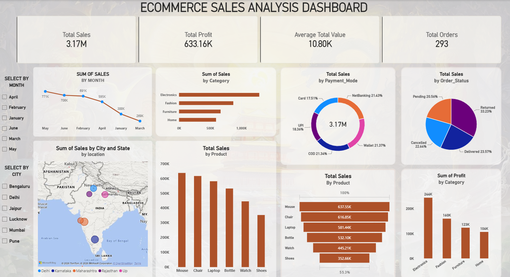

# E-Commerce Sales Analysis

An end-to-end e-commerce analytics project that transforms raw order data into a clean, analysis-ready dataset and an interactive Power BI dashboard. The project is designed to help stakeholders monitor sales performance, customer behavior, product trends, and regional results.



## Project Overview

This analysis follows a practical business-intelligence workflow:

1. Prepare and clean the raw e-commerce data.
2. Explore the data with SQL and Python.
3. Build an interactive Power BI dashboard for business reporting.
4. Surface actionable insights around revenue, orders, products, customers, and geography.

## Repository Contents

| File | Description |
| --- | --- |
| `Ecommerce_Unclean_Project.xlsx` | Original raw e-commerce dataset. |
| `Cleaned_Ecommerce.xlsx` | Cleaned dataset used for analysis and reporting. |
| `analysis.sql` | SQL queries for data exploration and business analysis. |
| `analysis.ipynb` | Python notebook for exploratory data analysis. |
| `ecommerce_analysis.pbix` | Interactive Power BI dashboard. |
| `ecommerce_dashboard.png` | Dashboard preview image. |

> File names above reflect the project assets. Update them if your repository uses different names or extensions.

## Business Questions Answered

- How are sales and orders trending over time?
- Which product categories and products contribute most to revenue?
- Which customer segments generate the greatest value?
- Which regions or locations perform best?
- What patterns can guide inventory, marketing, and sales decisions?

## Tools & Technologies

- **Microsoft Excel** — source data and cleaned dataset
- **SQL** — querying, aggregation, and analysis
- **Python / Jupyter Notebook** — data exploration and visualization
- **Power BI** — dashboard development and interactive reporting

## Workflow

```text
Raw Excel Data
      ↓
Data Cleaning & Validation
      ↓
SQL + Python Exploratory Analysis
      ↓
Power BI Data Model & Measures
      ↓
Interactive E-Commerce Dashboard
```

## Getting Started

### Prerequisites

- Microsoft Excel
- Power BI Desktop
- A SQL environment compatible with the queries in `analysis.sql`
- Python 3 with Jupyter Notebook (optional, for the notebook)

### Run the Project

1. Clone this repository.
2. Review the raw data in `Ecommerce_Unclean_Project.xlsx`.
3. Use `Cleaned_Ecommerce.xlsx` for analysis and dashboard refreshes.
4. Run the queries in `analysis.sql` in your SQL environment.
5. Open `analysis.ipynb` in Jupyter Notebook to reproduce the Python analysis.
6. Open `ecommerce_analysis.pbix` in Power BI Desktop to explore or refresh the dashboard.

## Dashboard Highlights

The Power BI dashboard is intended to provide an at-a-glance view of key business metrics, including:

- Sales and order performance over time
- Top-performing products and categories
- Customer and regional performance
- Interactive filters for focused analysis

## Data Notes

The raw dataset is retained separately from the cleaned file to make the transformation process transparent and reproducible. Before using the data in production, validate field definitions, refresh dates, currency conventions, and missing-value treatment for your environment.

## Future Enhancements

- Add profit, margin, discount, and return-rate analysis
- Introduce customer cohort and repeat-purchase analysis
- Automate data refreshes and data-quality checks
- Publish the Power BI report to Power BI Service

## Author

**Priyanshu Bisht**  
---
